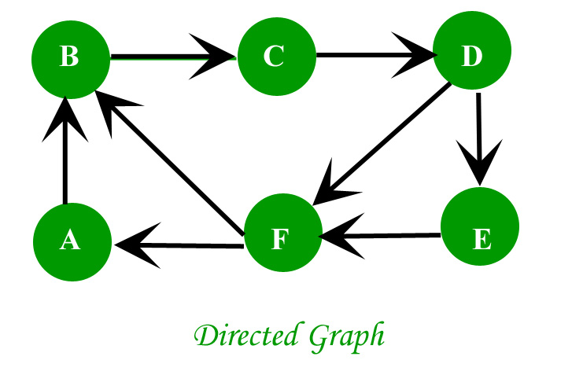
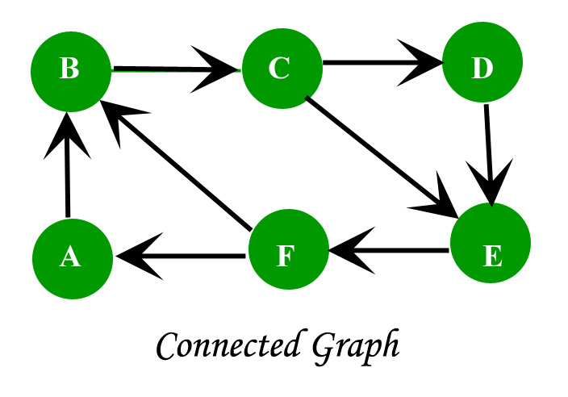
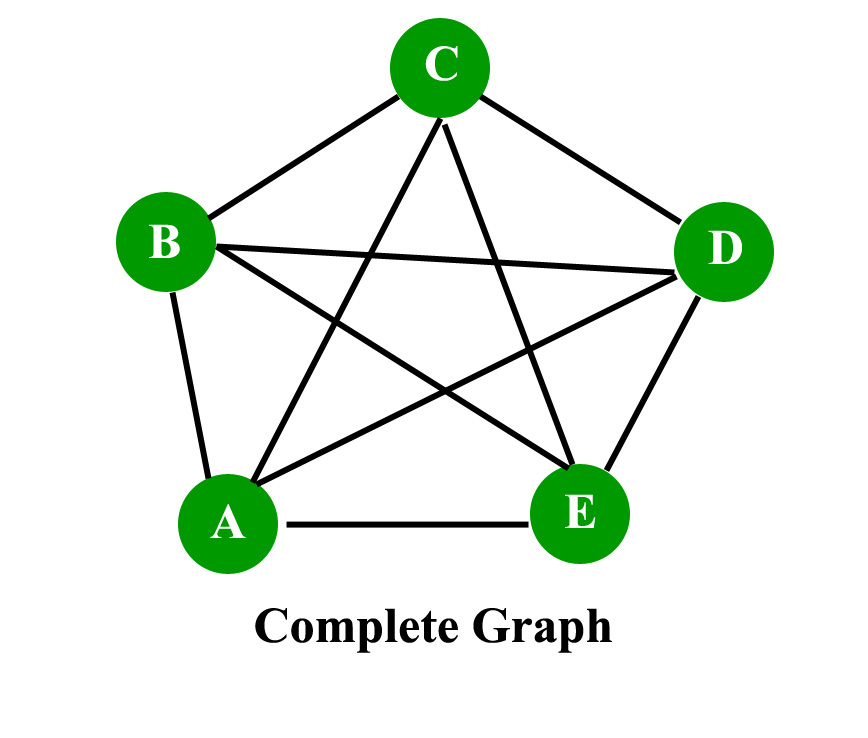

# Graph Theory.

In mathematics, graph theory is the study of graphs, which are mathematical structures used to model pairwise relations between objects. A graph in this context is made up of vertices which are connected by edges.
A graph is a data structure that is defined by two components:
* A node or a vertex.
* An edge E or ordered pair is a connection between two nodes u,v that is identified by unique ```pair(u,v)```. The pair (u,v) is ordered because ```(u,v)``` is not same as ```(v,u)``` in case of directed graph.The edge may have a weight or is set to one in case of unweighted graph.

Consider the given below graph...


### Applications:
Graph is a data structure which is used extensively in our real-life.

1. Social Network: Each user is represented as a node and all their activities,suggestion and friend list are represented as an edge between the nodes.
2. Google Maps: Various locations are represented as vertices or nodes and the roads are represented as edges and graph theory is used to find shortest path between two nodes.
3. Recommendations on e-commerce websites: The “Recommendations for you” section on various e-commerce websites uses graph theory to recommend items of similar type to user’s choice.
4. Graph theory is also used to study molecules in chemistry and physics.

### Characteristics of graphs:
#### 1. Adjacent node: 
A node ‘v’ is said to be adjacent node of node ```u``` if and only if there exists an edge between ```u``` and ```v```.
#### 2. Degree of a node: 
In an undirected graph the number of nodes incident on a node is the degree of the node. In case of directed graph ,Indegree of the node is the number of arriving edges to a node. Outdegree of the node is the number of departing edges to a node.

#### 3. Path: 
A path of length ```n``` from node ```u``` to node ```v``` is defined as sequence of ```n+1``` nodes.
```
P(u,v)=(v0,v1,v2,v3…….vn)
```
A path is simple if all the nodes are distinct,exception is source and destination are same.

#### 4. Isolated node: 
A node with degree 0 is known as isolated node.Isolated node can be found by Breadth first search(BFS). It finds its application in LAN network in finding whether a system is connected or not.

### Types of Graphs.


#### 1. Directed graph:
A graph in which the direction of the edge is defined to a particular node is a directed graph. 
* Directed Acyclic graph: It is a directed graph with no cycle.For a vertex ‘v’ in DAG there is no directed edge starting and ending with vertex ‘v’.
- Application :Critical game analysis,expression tree evaluation,game evaluation.
* Tree: A tree is just a restricted form of graph.That is, it is a DAG with a restriction that a child can have only one parent.


#### 2. Un-directed graph:
A graph in which the direction of the edge is not defined.So if an edge exists between node ‘u’ and ‘v’,then there is a path from node ‘u’ to ‘v’ and vice versa.


* Connected graph: A graph is connected when there is a path between every pair of vertices.In a connected graph there is no unreachable node.

* Complete graph: A graph in which each pair of graph vertices is connected by an edge.In other words,every node ‘u’ is adjacent to every other node ‘v’ in graph ‘G’.A complete graph would have n(n-1)/2 edges.See below for proof.

* Biconnected graph: A connected graph which cannot be broken down into any further pieces by deletion of any vertex.It is a graph with no articulation point.
