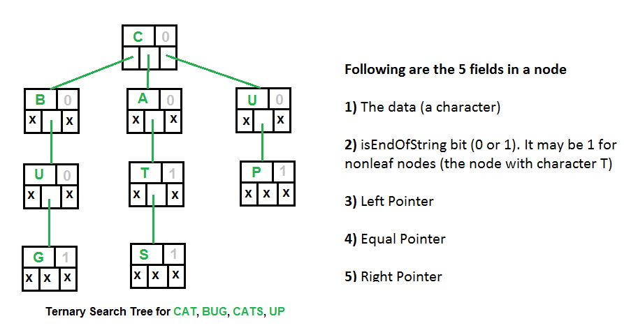

# py_data_structures_and_algorithm 🔥
Problem Solving with Data Structures and Algorithms using Python. 

Let's make it interesting

#### Algorithms + Data Structures = Programs

To answer why DSA are important? It's because, they are what you do after you've become a computer scientist... As you can guess, the most we can optimize is the 2nd step, which is where we have Data structures and algorithm.
## [1. Data Structure.](https://www.datacamp.com/community/tutorials/data-structures-python)

## Types of Data Structures.
### 1. Linked List Data Structure.
* It's a linear data structure where each element is a separate object. Each element (we will call it a node) of a list is comprising of two items - the data and a reference to the next node. The last node has a reference to null. The entry point into a linked list is called the head of the list.

### 2. Binary Search Tree Algorithm Data Structure.
* The recursive structure of a BST yields a recursive algorithm. Searching in a BST has ```O(h)``` worst-case runtime complexity, where h is the height of the tree. Since s binary search tree with n nodes has a minimum of ```O(log n)``` levels, it takes at least ```O(log n)``` comparisons to find a particular node.

#### Binary Search Tree, is a node-based binary tree data structure which has the following properties:
- The left subtree of a node contains only nodes with keys lesser than the node’s key.
- The right subtree of a node contains only nodes with keys greater than the node’s key.
- The left and right subtree each must also be a binary search tree.
- There must be no duplicate nodes.
 


### 3. AVL Trees (Adelson-Velskii and Landis) Data Structure
AVL tree is a self-balancing Binary Search Tree (BST) where the difference between heights of left and right subtrees cannot be more than one for all nodes. An Example Tree that is an AVL Tree. The above tree is AVL because differences between heights of left and right subtrees for every node is less than or equal to 1.

#### Insertion
To make sure that the given tree remains AVL after every insertion, we must augment the standard BST insert operation to perform some re-balancing. Following are two basic operations that can be performed to re-balance a BST without violating the BST property (keys(left) < key(root) < keys(right)).
1) Left Rotation
2) Right Rotation
#### Steps to follow for insertion
Let the newly inserted node be w
1) Perform standard BST insert for w.
2) Starting from w, travel up and find the first unbalanced node. Let z be the first unbalanced node, y be the child of z that comes on the path from w to z and x be the grandchild of z that comes on the path from w to z.
3) Re-balance the tree by performing appropriate rotations on the subtree rooted with z. There can be 4 possible cases that needs to be handled as x, y and z can be arranged in 4 ways. Following are the possible 4 arrangements:
* y is left child of z and x is left child of y (Left Left Case)
* y is left child of z and x is right child of y (Left Right Case)
* y is right child of z and x is right child of y (Right Right Case)
* y is right child of z and x is left child of y (Right Left Case)
```
T1, T2 and T3 are subtrees of the tree 
rooted with y (on the left side) or x (on 
the right side)           
     y                               x
    / \     Right Rotation          /  \
   x   T3   - - - - - - - >        T1   y 
  / \       < - - - - - - -            / \
 T1  T2     Left Rotation            T2  T3
Keys in both of the above trees follow the 
following order 
 keys(T1) < key(x) < keys(T2) < key(y) < keys(T3)
So BST property is not violated anywhere.
```
Another example of self-balancing tree.


### 4. Heap Data Structure
A Heap is a special Tree-based data structure in which the tree is a complete binary tree. Generally, Heaps can be of two types: For example, if is the parent node of , then the value of follows a specific order with respect to the value of and the same order will be followed across the tree.

#### 1. Max-Heap: 
In a Max-Heap the key present at the root node must be greatest among the keys present at all of it’s children. The same property must be recursively true for all sub-trees in that Binary Tree.
#### 2. Min-Heap: 
In a Min-Heap the key present at the root node must be minimum among the keys present at all of it’s children. The same property must be recursively true for all sub-trees in that Binary Tree.


### 5. Ternary Search Tree
A ternary search tree is a special trie data structure where the child nodes of a standard trie are ordered as a binary search tree. Ternary search tree can be used as an associative map structure with the ability for incremental string search.
##### Representation of ternary search trees:
Unlike trie(standard) data structure where each node contains 26 pointers for its children, each node in a ternary search tree contains only 3 pointers:
* The left pointer points to the node whose value is less than the value in the current node.
* The equal pointer points to the node whose value is equal to the value in the current node.
* The right pointer points to the node whose value is greater than the value in the current node.
   

Another Example, Insert(): cup, cape, bat, map, and can 


##### Applications of ternary search trees:
* Auto complete feature. Ternary search trees are efficient for queries like “Given a word, find the next word in dictionary(near-neighbor lookups)” or “Find all telephone numbers starting with 9342 or “typing few starting characters in a web browser displays all website names with this prefix”
*  Used in spell checks: Ternary search trees can be used as a dictionary to store all the words. Once the word is typed in an editor, the word can be parallely searched in the ternary search tree to check for correct spelling.

## [2. Graph Theory.](https://github.com/RocqJones/py_data_structures_and_algorithm/blob/master/Graph_Algorithm/README.md)
### 1. Breadth-First-Search (BFS)
* In BFS we visit each vertex exactly once. Therefore, we visit each neighbour vertex with their preciding neighbours.
Algorithm Complexity Time: ```O(V+E)``` V - Vertex and E - Edge.
#### Applications of BFS.
- Constructing shortest path tree: Dijkstra shortest path algorithm does a BFS if all edge weight is == 1.
- In AI/ Machine Learning: Robots can discover the sorrounding more easily with BFS than DFS.
- Maximum flow: The Edmonds-Karp maximum flow algorithm uses BFS for finding augmenting paths.
- [Cheney's algorithm in garbage collection](https://en.wikipedia.org/wiki/Cheney%27s_algorithm). Similar to mark and sweep gc procedure. This helps in mantaining active references (use BFS to detect all references on [heap memory](https://heap-exploitation.dhavalkapil.com/heap_memory.html))

### 2. Depth-First-Search (DFS)
* It's a traversal algorithm which exposes far as possible along each branch before backtracking.
* It doesn't need pointers and its memory friendly.
Algorithm Complexity Time: ```O(V+E)``` Vertex and E - Edge.
#### Applications.
- Topological ordering of Kosaraju algorithm or deleting cycles([DAG](https://en.wikipedia.org/wiki/Directed_acyclic_graph))

#### BFS and DFS illustration.

